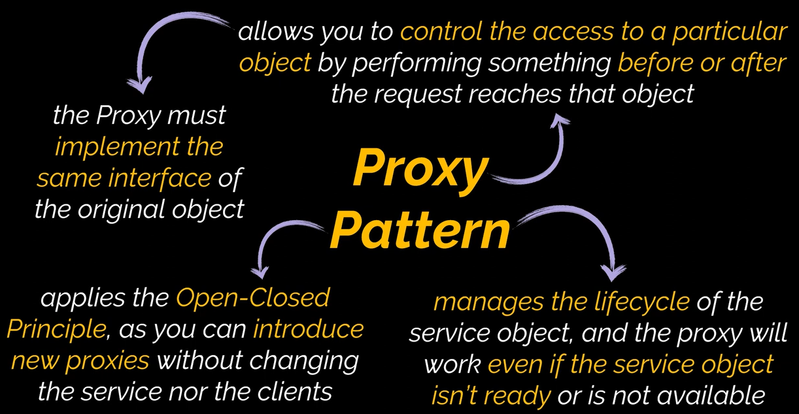
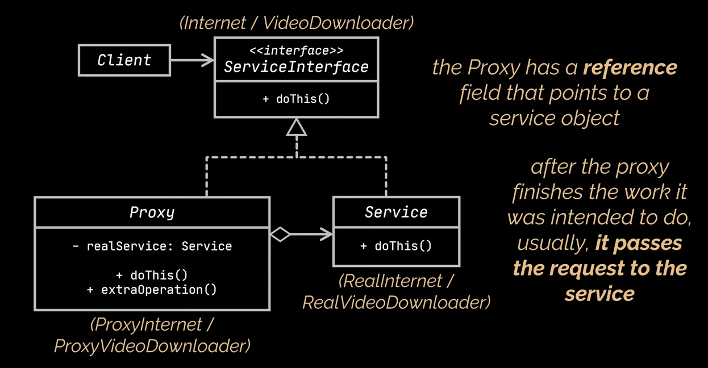

## Proxy Pattern definition

Proxy is a structural design pattern that provides a substitute for another object and controls access to that object, allowing you to perform something before or after the request reaches the original object.

## Class Diagram

## Examples

In this repo there are 2 examples to explain the Proxy pattern :

- `Internet`: Assume you want to conntect to the internet without any restrictions, and in some cases the client want to block some web sites. Client want to have both options (the un restricted internet , the restricted internet access).
- `Downloader`: Assume you want to download vidoes with the caching option, so if the video is downloaded previously get it from the cache. Client Also want the 2 options either loaded data from cache (if cached) or fresh downloaded video.
 
 
## Reference

More details can be found here: [refactoring.guru](https://refactoring.guru/design-patterns/proxy).
